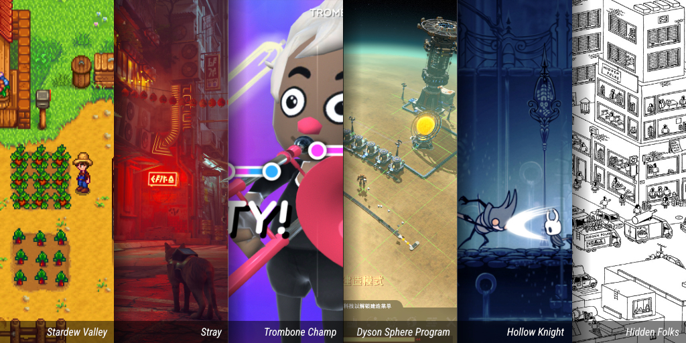

# Introduction aux jeux vidéo

> **[Ludisme](https://www.larousse.fr/dictionnaires/francais/ludisme/48009)** n.m. 
> Comportement caractérisé par la recherche systématique du jeu sous toutes ses formes. 
> latin *ludus*, jeu, [*ludologie*](https://vitrinelinguistique.oqlf.gouv.qc.ca/fiche-gdt/fiche/26502181/ludologie)

Le ludisme se caractérise par l’**engagement** et l'ensemble des **comportements** d'une personne vis-à-vis un **jeu**. La notion d’**amusement** et d'**expérimentation** est essentielle au développement de l’aspect ludique de l'expérience.

### Quelques ressources

#### Distributeurs

* [Steam](https://steampowered.com/)
* [Itch.io](https://itch.io/)
* [Epic Games](https://www.epicgames.com/)
* [GOG](https://www.gog.com/)

#### Statistiques

* [SteamDB](https://steamdb.info/)
* [Games Stats](https://games-stats.com/)
* [HowLongToBeat](https://howlongtobeat.com/)
* [IsThereAnyDeal](https://isthereanydeal.com/)

#### Assets

Ressources utilisées pour créer le contenu visuel et sonore d'un jeu.

Voici une petite liste de sources offrant des assets 2D gratuits.

* [Kenney](https://kenney.nl/assets/category:2D)
* [Itch.io](https://itch.io/game-assets/free/tag-2d)
* [Craftpix](https://craftpix.net/freebies/)
* [Opengameart](https://opengameart.org/)
* [Gamedevmarket](https://www.gamedevmarket.net/)
* [Gameart2d](https://www.gameart2d.com/freebies.html)
* [Reddit](https://www.reddit.com/r/gameassets/)

#### Inspirations

* [Reddit: r/gamedevscreens](https://www.reddit.com/r/gamedevscreens/)
* [Reddit : r/destroymygame](https://www.reddit.com/r/DestroyMyGame/)
* [Reddit : r/indiedev](https://www.reddit.com/r/IndieDev/)
* [Reddit : r/gamedesign](https://www.reddit.com/r/gamedesign/)
* [Itch.io : 2d](https://itch.io/games/tag-2d)

### Vocabulaire

>  Le boss du dlc est juste op. J'ai lu sur le devlog qu'ils vont nerfer son dps dans la prochaine patch.

Il est très utile de comprendre le [lexique](https://gamingcampus.fr/boite-a-outils/lexique-du-jeu-video-100-mots-du-jeu-video.html#:~:text=HUD%20%3A,traduit%20par%20Affichage%20T%C3%AAte%20Haute.) qui entoure le monde des jeux vidéo.

En prendre connaissance facilite non seulement la compréhension de la culture, mais aide aussi à articuler clairement les concepts envisagés[^jeuxvideolexique] dans la création et le développement de votre jeu vidéo.

### Types de jeu

Voici une liste non exhaustive des différents [types de jeux vidéo](https://en.wikipedia.org/wiki/List_of_video_game_genres).

#### Action

* Plateforme (Super Mario World)
* FPS (Counter Strike)
* TPS (Resident Evil)
* Combat (Street Fighter)
* Beat'em Up (Castle Crashers)
* Infiltration (Thief)
* Survie (The Forest)
* Rythme (Beat Saber)
* Battle Royale (Fortnite)
* Metroidvania (Blasphemous)
* [FPS] : Jeu de tir à la première personne (First-person shooter)
* [TPS] : Jeu de tir à la troisième personne (Third-person shooter)

#### Aventure

* Monde ouvert (Grand Theft Auto V)
* Nouvelles graphiques (Aviary Attorney)
* Point & Click (Monkey Island)
* Films interactifs (Life Is Strange)

#### Casse-tête

* Physique (Kerbal Space Program)
* Programmation (Shenzhen I/O)
* Exploration (The Witness)
* Objets cachés (Hidden Folks)
* Évasion (Escape Simulator)
* Traditionnel (Tetris)

#### Jeu de rôle (RPG)

* Action (Diablo 4)
* CRPG (Baldur’s Gate 3)
* Roguelike (Hades)
* Tactique (Wartales)
* [RPG] : Jeu de rôle (Role-Playing Game)
* [CRPG] : Jeu de rôle sur ordinateur (Computer Role-Playing Game)

#### Simulation

* Vie (The Sims)
* Gestion et construction (Stardew Valley)
* Conduite (American Truck Simulator)
* Carré de sable (Minecraft)

#### Stratégie

* 4X (Civilization VI)
* Auto battler (Totally Accurate Battle Simulator)
* MOBA (League of Legends)
* RTS (StarCraft)
* RTT (Total War)
* Tower defense (Plants vs. Zombies)
* TBS (XCOM)
* Grand strategy wargames (Stellaris)
* [4X] : Exploration, expansion, exploitation et extermination (eXplore, eXpand, eXploit, eXterminate)
* [MOBA] : Arène de bataille en ligne multijoueur (multiplayer online battle arena)
* [RTS] : Jeu de stratégie en temps réel (Real-time strategy)
* [RTT] : Jeu de tactique en temps réel (Real-time tactics)
* [TBS] : Jeu de stratégie au tour par tour (Turn-based strategy)

#### Sports

* Course (Mario Kart)
* Équipe (FIFA)
* Combat (UFC)
* Sport individuel (Tony Hawk's Pro Skater)

#### Autres genres

* Jeu de société (Jackbox Party Pack)
* Jeu de cartes (Baltro)
* Incrémentiel ((the) Gnorp Apologue)
* Dactylographie (Epistory)

### Plateformes

#### Console

* PlayStation
* Xbox
* Nintendo

#### PC

* Windows
* Mac
* Linux
* Steam Deck

#### Mobile

* iOS (Apple)
* Android (Google)

#### Réalité virtuelle (VR)

* Meta Quest
* PlayStation VR
* HTC Vive
* Valve Index

#### Réalité augmentée (AR)

* Microsoft HoloLens
* Apple Vision Pro

#### Jeux infonuagiques

* Xbox Cloud Gaming
* NVIDIA GeForce Now
* Amazon Luna

#### Navigateur Web

* HTML5
* WebGL / WebAssembly

### Contrôles de jeux vidéo

* Clavier et souris
* Manette de jeu
* Écran tactile
* Joystick

[Aperçu non exhaustif des contrôles en jeux vidéo](https://en.wikipedia.org/wiki/List_of_game_controllers)
