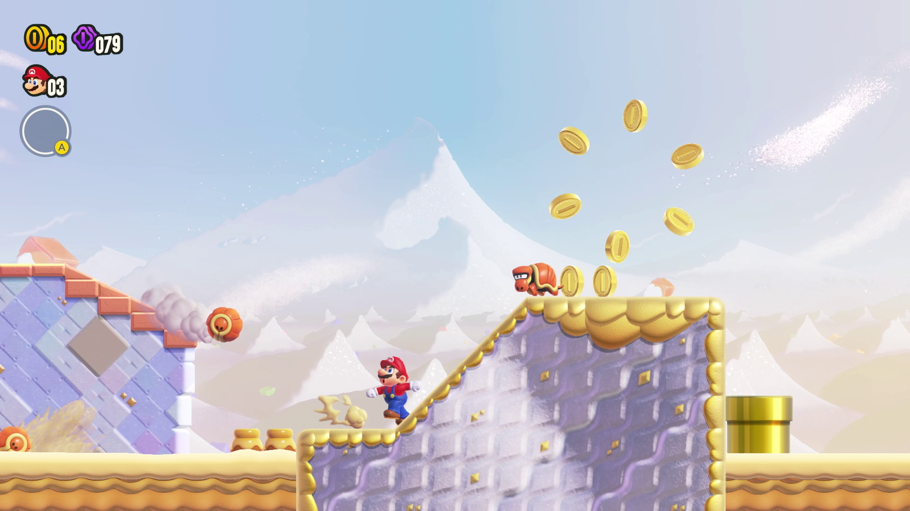

# Notions d’interaction

## Définitions

- **Interacteur** — l'agent qui agit sur le système. En jeu, l'interacteur est typiquement le joueur (via clavier, manette, écran tactile) mais peut aussi être un autre système (IA, serveur). L'interacteur initie des actions et attend une réponse.

- **Interaction** — l'échange concret entre interacteur et système : appuyer un bouton, déplacer un avatar, sélectionner un objet, ou choisir une option de dialogue. C'est l'événement observable et mesurable.

- **Interactivité** — la qualité globale du système à répondre aux actions de l'interacteur : réactivité, variété des réponses, adaptabilité. L'interactivité décrit à quel point le joueur peut influencer l'expérience et percevoir l'effet de ses actions.

- **Affordance** — les indices perceptifs qui suggèrent comment agir sur un élément (d'après Donald Norman). En jeu, une affordance peut être visuelle (une poignée brillante), sonore (un objet qui émet un son attirant), cinématique (un marqueur qui pulse) ou via le curseur.

## Application dans un context ludique

- Plateforme : un rebord qui dépasse et une animation de saut indiquent que le joueur peut sauter (affordance) ; le saut est l'interaction déclenchée par l'interacteur.
- Interface HUD : un bouton qui s'illumine quand il est disponible combine affordance + feedback, renforçant l'interactivité perçue.
- Puzzle : une clé qui brille dans une pièce signale sa possibilité d'être ramassée ; si ramasser n'entraîne aucun retour, l'interactivité paraît pauvre.

## Bonnes pratiques pour l'intégrateur

- Rendre les affordances découvertes et cohérentes : signaux visuels/sonores uniformes pour les mêmes actions.
- Fournir un feedback immédiat et visible après chaque interaction (son, particules, vibration) pour renforcer l'interactivité.
- Éviter les fausses affordances (éléments qui semblent actionnables mais ne le sont pas) ; si impossibilité, communiquer clairement la contrainte.
- Prévoir une montée en complexité : commencer par affordances claires, puis introduire affordances cachées ou contextuelles pour la découverte.
