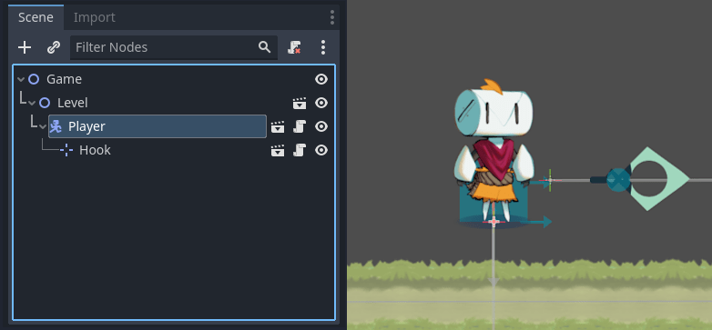
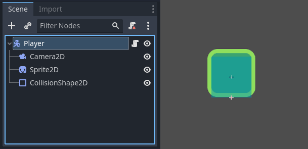
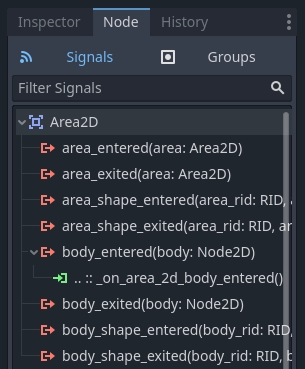
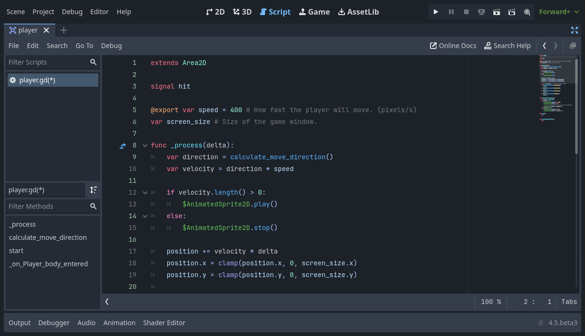
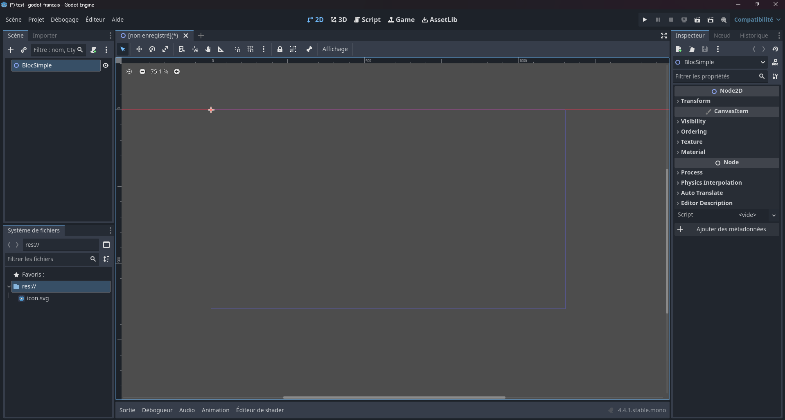
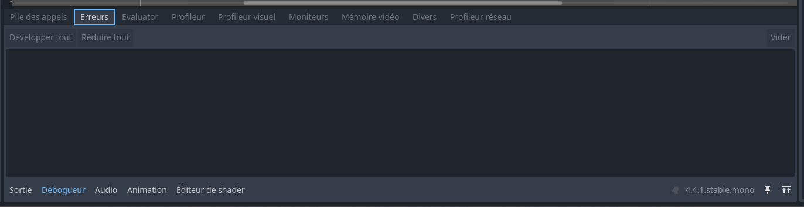
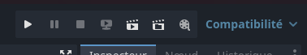

# Introduction à Godot

!> On va toujours travailler avec la version de [Godot 4.4.1 (stable)](https://godotengine.org/download/archive/4.4.1-stable/). Vous pouvez toujours consultez toujours la [documentation officielle](https://docs.godotengine.org/fr/4.x/). 

## Concepts clés

Adapté de la documentation officielle. Pour plus d'information, révisez-la [ici](https://docs.godotengine.org/fr/4.x/getting_started/introduction/key_concepts_overview.html).

### Scènes

> Dans Godot, vous décomposez votre jeu en scènes réutilisables. Une scène peut être un personnage, une arme, un menu dans l'interface utilisateur, une maison, un niveau entier, ou n'importe quoi d'autre. Les scènes Godot sont flexibles : elles remplissent le même rôle que les prefabs ou les scènes dans d'autres moteurs de jeu.




### Nœuds

> Une scène est composée de un ou plusieurs nœuds. Les nœuds sont les plus petits blocks de construction de votre jeu que vous organisez en arbres.



#### Signaux

> Les nœuds émettent des signaux quand certains événements ont lieu. Cette fonctionnalité vous permet de faire communiquer les nœuds entre eux sans avoir à l'expliciter dans le code. Cela offre beaucoup plus de flexibilité dans la façon de structurer vos scènes.



### Scripts

Pour créer de la logique spécifique à nos jeux, on utilise des scripts attachés à des nœuds. Ces scripts ont accès à plusieurs fonctionnalités du système et nous permettent de connecter et de modifier le comportement des différents nœuds et scènes, ainsi que de définir l’interaction avec le joueur.

On peut utiliser plusieurs langages de programmation pour créer des scripts en Godot. On va travailler avec GDScript, un langage spécialisé pour la création de jeux qui est inspiré sur Python et JavaScript. 

```gdscript
extends Sprite2D

var speed = 400
var angular_speed = PI


func _process(delta):
	rotation += angular_speed * delta

	var velocity = Vector2.UP.rotated(rotation) * speed

	position += velocity * delta
```



## Tour du logiciel




### Interface

- Système de fichiers / File system : montre la structure des fishiers du projet.
- Importer : configure l'importation de différents fichiers de médias (audio, images, modèles 3D).
- Scène / Scene : montre l'arbre de scène courante.
- 2D/3D : montre l'espace de la scène 2D ou 3D courante.
- Script : l éditeur de code intégré dans Godot.
- Game : quand le jeu est en éxecution, le résultat intéractif est montré ici.
- Inspecteur / Inspector : montre les propriétés de le noeus ou asset selectionné.
- Noeud / Node : les connexions logiques entre les noeuds avec des signaux.
- Menu d'exécution : permet jouer le jeu pendant le développment.
- Panneau de sortie et débogueur / Output et Debugger: montre les erreurs de code et les messages pendant l'exécution du jeu.




### Outils importants

- Projets > Paramètres du projet / Project settings : configuration de toutes les propriétés de l'ensemble du projet (dispositifs d'entrée, carte d'inputs, autoloads).