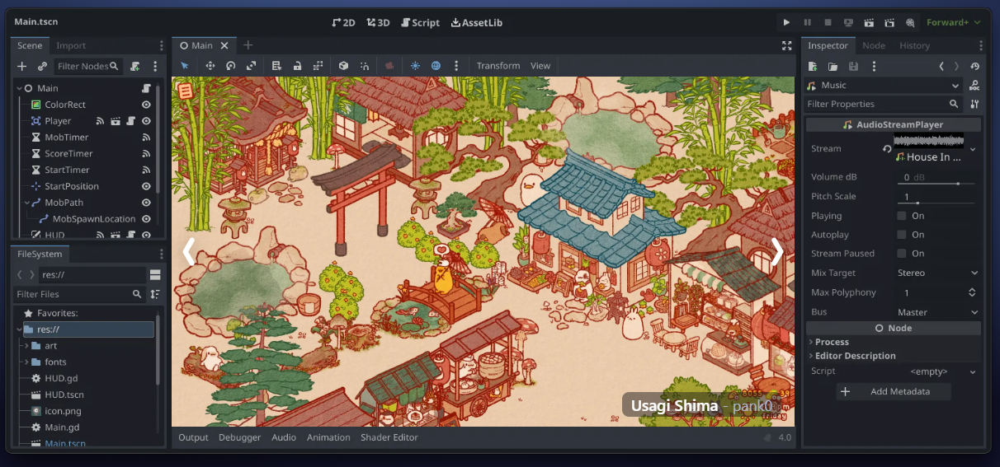

# Moteurs de jeu

## Fonctionnalités de base

- Structure d'événements et gestion d'interactivité en temps réel
- Simulations physique 2D et 3D avancées et performantes
- Outils d'édition intégrés pour la création et placement d'objets, customisation de propriétés et importation de média.
- Écosystèmes de plugins e paquets d'assets
- Intégration et optimisation de plusieurs formats médias : images matricielles, modèles et animations 3D, différents formats d'audio et plugins.
- Variété de systèmes internes pour la création de l'interface utilisateur (UI)
- Exportation standardisée et d'haute performance
- Traitement de plusieurs dispositifs d'entrée (souris, claviers, manettes, VR/AR)
- Systèmes pour networking
- Systèmes pour la gestion de mémoire et données
- Rendu visuel avancé

---

Les pages suivantes présentent des fiches comparatives courtes des moteurs de jeu *publiques* le plus populaires et utilisés dans l'industrie. Une gran proportion de jeux vidéo sont crées avec des logiciels propriétaires et confidentiels qui sont utilisés seulement dans certaines compagnies (exemple : [Frostbite](https://www.ea.com/frostbite/engine)).

<!-- start-replace-subnav depth=1 -->
* [Godot](/02-savoirs/04-moteurs-de-jeu/godot/)
* [Unity](/02-savoirs/04-moteurs-de-jeu/unity/)
* [Unreal Engine](/02-savoirs/04-moteurs-de-jeu/unreal/)
<!-- end-replace-subnav -->