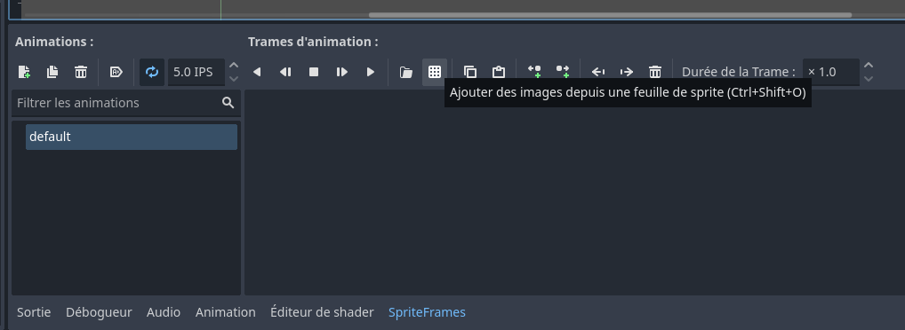
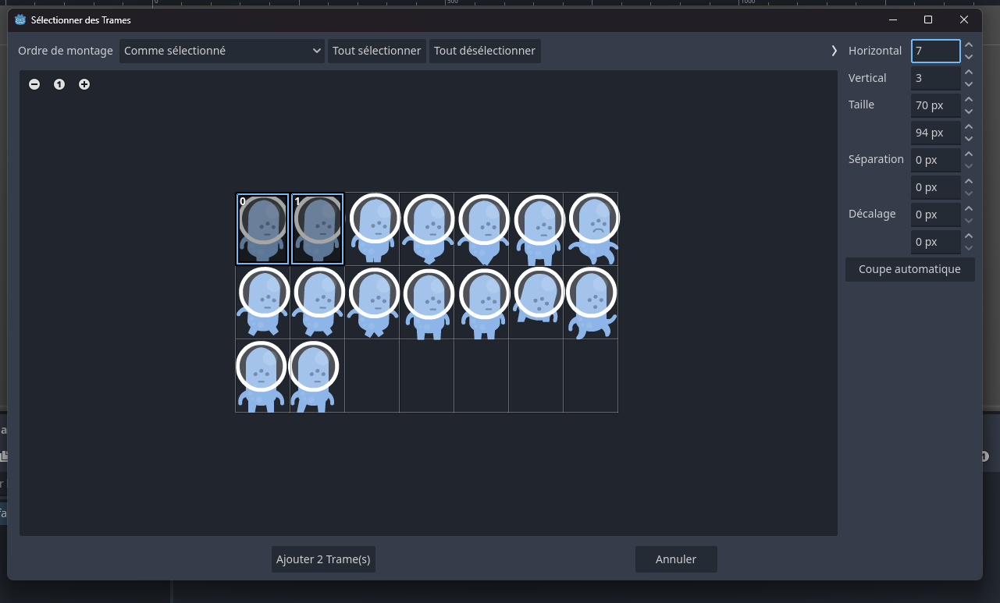

# Intégration d'images et des animations 2D

## Ajout d'images

Pour ajouter une image à un projet, on peut le glisser sur la fênetre **FileSystem**. On peut aussi changer les options d`importation pour ce fichier dans la fenêtre **Import**.

## Définition d'animations frame par frame

Pour des [images individuelles avec frames d'animation](https://docs.godotengine.org/fr/4.x/tutorials/2d/2d_sprite_animation.html#individual-images-with-animatedsprite2d) : 

1. On peut utiliser un noeud **AnimatedSprite2D**. 
2. Avec ce node, dans l' Inspecteur, on ajoute un nouveau ressource du type **SpriteFrames**.
3. L' éditeur de SpriteFrames en bas de l' écran nous permet de glisser les frames, les ordonner et définir plusieurs animations.
4. On peut changer quelle animation joue en chageant la propriété `animation` du noeud **AnimatedSprite3D**.

Pour créer les animations a partir d'un fichier *spritesheet* (i.e. avec plusieurs frames dans un même fichier d'image), le processus est le même, mais on peu utilise le bouton de grille sur l'éditeur de **SpriteFrames**.



Après, on peut choisir des frames specifiques pour l'animation:



## Contrôle d' animations

> Une fois l'animation terminée, vous pouvez contrôler l'animation via le code en utilisant les méthodes `play()` et `stop()`. 

Voici un bref exemple pour lire l'animation tant que le bouton de la souris est maintenue enfoncée et l'arrêter lorsque vous le relâchez.

```gdscript
extends Node2D

@onready var animations = $AnimatedSprite2D

func _process(delta: float) -> void:
	if Input.is_mouse_button_pressed(MOUSE_BUTTON_LEFT):
		animations.play("default")
	else:
		animations.stop()
```
