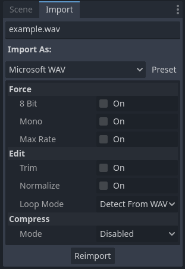
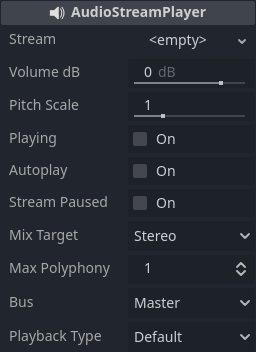

# Intégration d'audio

## Importation de fichier d'audio

Pour importer des échantillons sonores et musique, on peut glisser des fichiers audio (WAV, OGG, MP3 et d'autres) sur le **FileSystem**. Les options d'importation nous permettent de définir si un fichier joue en boucle ou les options liées a son format.

Pour plus d' informations sur les formats supportés, regardez la [documentation](https://docs.godotengine.org/fr/4.x/tutorials/assets_pipeline/importing_audio_samples.html).

## Flux audio et effets de traitement

Pour jouer un son, on utilise les nœuds **AudioStreamPlayer**, **AudioStreamPlayer2D** ou **AudioStreamPlayer3D**. Les nœuds **AudioStreamPlayer2D** ou **AudioStreamPlayer3D** peuvent spatialiser le son dans des environnements 2D ou 3D, en changeant le volume et placement pour augmenter l' immersion sonore. Le nœud **AudioStreamPlayer** joue le son sans simuler un espace spécifique.

Pour équilibrer le volume et appliquer des [effets de traitement](https://docs.godotengine.org/fr/4.x/tutorials/audio/audio_effects.html) aux sons d'un jeu, on peut grouper les sources audios dans différents canaux [*bus audio*](https://docs.godotengine.org/fr/4.x/tutorials/audio/audio_buses.html). Avec ces canaux c'est possible de faire le mix entre les sources et ajouter des effets comme le reverb et l'écho.

## Contrôle d'audio

Les noeuds de source audio (qui hérite **AudioStreamPlayer**) ont des [méthodes](https://docs.godotengine.org/fr/4.x/classes/class_audiostreamplayer.html#audiostreamplayer) comme `play()` et `stop()` pour contrôler quand jouer un son.
