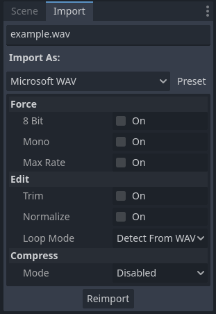
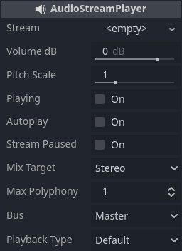

# Intégration d'audio

## Contexte Web en 30 s

* **Depuis Godot 4.3, l’export Web est *monothread* par défaut** (plus compatible sur iOS/macOS et les portails comme itch.io). Pour éviter les craquements audio en mono-thread, Godot utilise par défaut un **mode de lecture “Sample” via Web Audio**, pensé pour la faible latence — mais **avec des limites** (pas d’AudioEffects, pas de réverb/Doppler, génération procédurale non supportée, spatialisation parfois imparfaite). ([Godot Engine][1], [docs.godotengine.org][2])
* Si vous **activez les threads** pour retrouver la lecture “Stream” (latence plus haute mais effets et pitch complets), vous devrez **isoler le site** (COOP/COEP) ou **activer PWA** pour injecter automatiquement ces en-têtes. ([docs.godotengine.org][3], [Godot Engine][1])
* Côté navigateur : **audio et plein écran doivent être déclenchés suite à un geste utilisateur** (\_input/\_unhandled\_input). De plus, **l’onglet inactif met en pause** `_process()`/`_physics_process()`. Prévoyez-le. ([docs.godotengine.org][3])

## Importation de fichier d'audio

Pour importer des échantillons sonores et musique, on peut glisser des fichiers audio (WAV, OGG, MP3 et d'autres) sur le **FileSystem**. Les options d'importation nous permettent de définir si un fichier joue en boucle ou les options liées a son format.



Pour plus d' informations sur les formats supportés, regardez la [documentation](https://docs.godotengine.org/fr/4.x/tutorials/assets_pipeline/importing_audio_samples.html).

## Flux audio et effets de traitement

Pour jouer un son, on utilise les nœuds **AudioStreamPlayer**, **AudioStreamPlayer2D** ou **AudioStreamPlayer3D**. Les nœuds **AudioStreamPlayer2D** ou **AudioStreamPlayer3D** peuvent spatialiser le son dans des environnements 2D ou 3D, en changeant le volume et placement pour augmenter l' immersion sonore. Le nœud **AudioStreamPlayer** joue le son sans simuler un espace spécifique.



Pour équilibrer le volume et appliquer des [effets de traitement](https://docs.godotengine.org/fr/4.x/tutorials/audio/audio_effects.html) aux sons d'un jeu, on peut grouper les sources audios dans différents canaux [*bus audio*](https://docs.godotengine.org/fr/4.x/tutorials/audio/audio_buses.html). Avec ces canaux c'est possible de faire le mix entre les sources et ajouter des effets comme le reverb et l'écho.

## Contrôle d'audio

Les noeuds de source audio (qui hérite **AudioStreamPlayer**) ont des [méthodes](https://docs.godotengine.org/fr/4.x/classes/class_audiostreamplayer.html#audiostreamplayer) comme `play()` et `stop()` pour contrôler quand jouer un son. Les exemples suivants montrent des strat/gies et paticularités de contrôle audio pour la web.

### Déclencher un son par **événement** (signal) — compatible Web

- Objectif : jouer un SFX quand le joueur entre dans une zone. 
- Scène : `Area2D` > `CollisionShape2D` + `AudioStreamPlayer2D` (SFX assigné).

```gdscript
# Sur Area2D.gd (Godot 4.x)
extends Area2D
@onready var sfx: AudioStreamPlayer2D = $AudioStreamPlayer2D

func _ready() -> void:
    body_entered.connect(_on_body_entered)  # signal idiomatique

func _on_body_entered(_body: Node) -> void:
    sfx.play()
```

`Area2D` émet `body_entered`/`area_entered` ; les **signals** sont la façon idiomatique de réagir aux événements. ([docs.godotengine.org][8])

### Timing précis avec `AnimationPlayer`

Dans une cinématique/UI créée avec l'éditeur d'animation, ajoutez une **Call Method Track** qui appelle `play()` au timecode voulu (aucun problème côté Web). ([docs.godotengine.org][9])

### “Déverrouiller” l’audio sur le navigateur (autoplay)

Sur le Web, l’audio **ne démarre qu’après un geste** (clic/toucher/touche). Montrez un écran “Cliquer pour activer l’audio”, puis jouez un son court pour initialiser le contexte.

```gdscript
# SoundGate.gd (attaché à un Control en overlay)
extends Control
@onready var gate := $Panel    # votre overlay
@onready var ping: AudioStreamPlayer = $Ping  # petit son (ou silence court)

func _ready() -> void:
    if OS.has_feature("web"):
        gate.visible = true

func _unhandled_input(event: InputEvent) -> void:
    if not OS.has_feature("web") or not gate.visible:
        return
    if event is InputEventMouseButton or event is InputEventKey or event is InputEventScreenTouch:
        gate.visible = false
        if ping.stream:
            ping.play()  # “débloque” l’audio, puis votre jeu peut jouer d’autres sons
```

Pourquoi ? **Le plein écran et l’audio doivent découler d’un événement d’entrée**, pas d’un simple `Input.is_action_pressed()` interrogé hors callback. ([docs.godotengine.org][3])

[1]: https://godotengine.org/article/progress-report-web-export-in-4-3/ "Web Export in 4.3 – Godot Engine"
[2]: https://docs.godotengine.org/en/latest/tutorials/export/exporting_for_web.html?utm_source=chatgpt.com "Exporting for the Web - Godot Docs"
[3]: https://docs.godotengine.org/en/4.4/tutorials/export/exporting_for_web.html?utm_source=chatgpt.com "Exporting for the Web — Godot Engine (4.4) documentation in ..."
[4]: https://docs.godotengine.org/en/4.4/classes/class_audiostreamplayer.html "AudioStreamPlayer — Godot Engine (4.4) documentation in English"
[5]: https://docs.godotengine.org/en/4.4/classes/class_audiostreamplayer2d.html "AudioStreamPlayer2D — Godot Engine (4.4) documentation in English"
[6]: https://docs.godotengine.org/en/4.4/classes/class_audiostreamplayer3d.html "AudioStreamPlayer3D — Godot Engine (4.4) documentation in English"
[7]: https://docs.godotengine.org/en/4.4/classes/class_audiostream.html?utm_source=chatgpt.com "AudioStream — Godot Engine (4.4) documentation in English"
[8]: https://docs.godotengine.org/en/4.4/classes/class_area2d.html?utm_source=chatgpt.com "Area2D — Godot Engine (4.4) documentation in English"
[9]: https://docs.godotengine.org/en/stable/tutorials/animation/animation_track_types.html "Animation Track types — Godot Engine (stable) documentation in English"