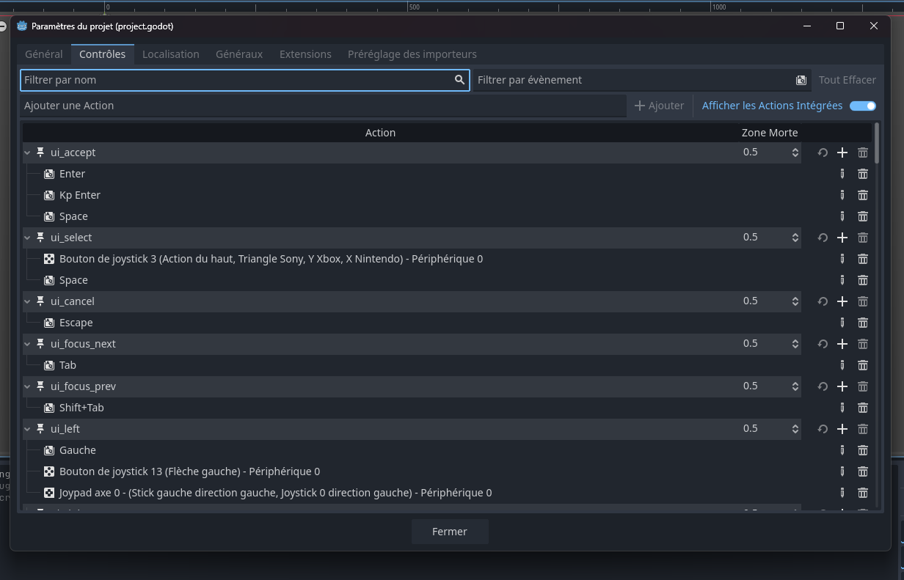

# Contrôles et dispositifs d'entrée

Les moteurs de jeu nous permettent de détecter et réagir aux changements des dispositifs d'entrée variés.

On a exploré comment utiliser un objet du type `InputEvent` pour detecter un évéenement de la souris : 

```gdscript
func _input(event: InputEvent) -> void:
	if event is InputEventMouseButton and event.is_pressed():
		print("bouton pressé")
```

On peut aussi utiliser la classe `Input` avec des actions que sont définis dans un **InputMap**: 

```gdscript

func _process(delta):
	if Input.is_action_pressed("ui_right"):
		# Faire une action.
```

Les actions groupent différents mappings d' entréee sur un même nom (exemple: `ui_right`). Elle nous permettent de déclencher des comportements avec le même code pour travailler sur différents appareils avec différentes entrées (par exemple, clavier sur PC, Joypad sur console).



Pour plus d' info sur les **InputEvents**, [regardez les docs](https://docs.godotengine.org/fr/4.x/tutorials/inputs/inputevent.html).

## Effets combinatoires entre intéractions

Un moteur de jeu permet aussi de combiner éléments visuels, sonores et logiques pour produire comportements complexes à partir d’interactions simples (ex. touches clavier). Ce document donne des pistes pratiques et exemples courts pour penser ces combinaisons.

Principes généraux
- Composition : mixer petits modules (sprite, audio player, animation, physics) pour créer un tout plus riche.
- Séparation des responsabilités : un nœud gère l'affichage, un autre le son, un autre la logique d’état.
- Événements et signaux : utiliser les signals (ou systèmes d’événements) pour chaîner réactions (ex. collision → signal → son + animation).
- Paramétrisation : automatiser paramètres audio/visuels (volume, pitch, couleur, scale) pour variations sans dupliquer de code.
- Non‑linéarité : introduire aléatoire contrôlé et temporisation (timers, tweens, courbes) pour comportement vivant.

Exemples d’usage
- Combiner touche + état + son :
  - Appui sur une touche → changer l’état du personnage → jouer un son adapté → déclencher une animation.
- Effets combinatoires audio-visuels :
  - Paramétrer pitch/filtre audio selon la vitesse du personnage; l’UI change de teinte selon le pitch.
- Interaction multiple (chords) :
  - Plusieurs touches simultanées mappées à voix différentes ; mixage et effets créent textures sonores évolutives.
- Réactions physiques :
  - Collision physique → lecture d’échantillon dont la fréquence dépend de la force d’impact + particules visuelles.

Exemple GDScript minimal
```gdscript
# Exemple : touche -> son + animation
func _input(event):
    if event.is_action_pressed("ui_accept"):
        $AudioStreamPlayer.pitch_scale = rand_range(0.9, 1.1)
        $AudioStreamPlayer.play()
        $AnimationPlayer.play("pulse")
```

Bonnes pratiques et performance
- Regrouper sons courts (SFX) via AudioStreamPlayer pour faible latence ;
- Tester sur cibles finales (navigateur WebGL/WASM, desktop) : latence et performances diffèrent.
- Documenter mappings clavier et comportements attendus pour l’évaluation.

Pensez modulation + orchestration : combiner petits éléments et règles simples produit des interactions riches et imprévisibles sans complexité monolithique.