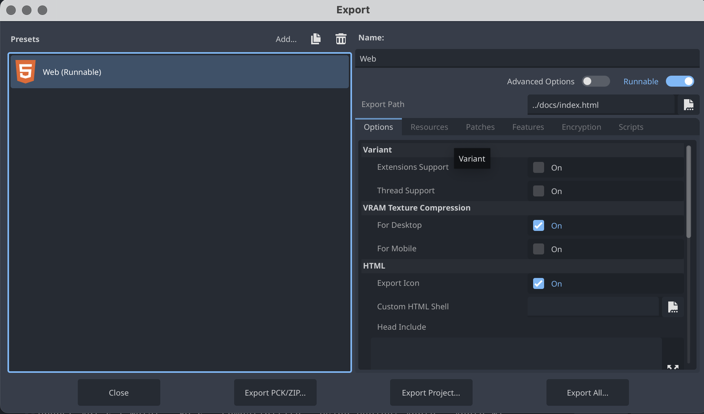

# Compilation de l’application (web export)

L'option d'exportation pour web prépare un dossier avec tous les fichiers necessaires (HTML, WASM, JS et médias) nécessaries pour que le jeu soit jouable dans un navigateur. Ce dossier peuvent être téléversé à un serveur pour publication comme un site web.

1. Choisir *Projet > Exporter sous...*.
2. Cliquer pour *Ajouter* un template d'exportatio et choisir *Web*
3. Choisir l' emplacement de les fichiers. Pour nos projets, c'est un dossier `docs` à la racine de notre dossier de repo ([cet emplaement est critique](/02-savoirs/05-classement-fichiers/))
4. Configurer les options d' exportation comme redimensionnement, etc.
5. Cliquer sur *Tout exporter...*

## Publication sur GitHub Pages

On va configurer notre dépôt sur GitHub pour creer un site web à ppartir du dossier `docs` de notre branche `main`. Voici les otions sur le menu **Settings**.

!> Pour éviter des problèmes de publication, il faut ajoute un fichier vide appelé `.nojekyll` à notre dossier `docs`.

