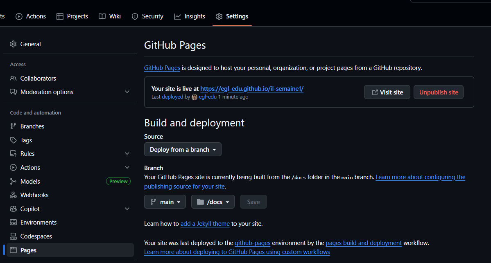
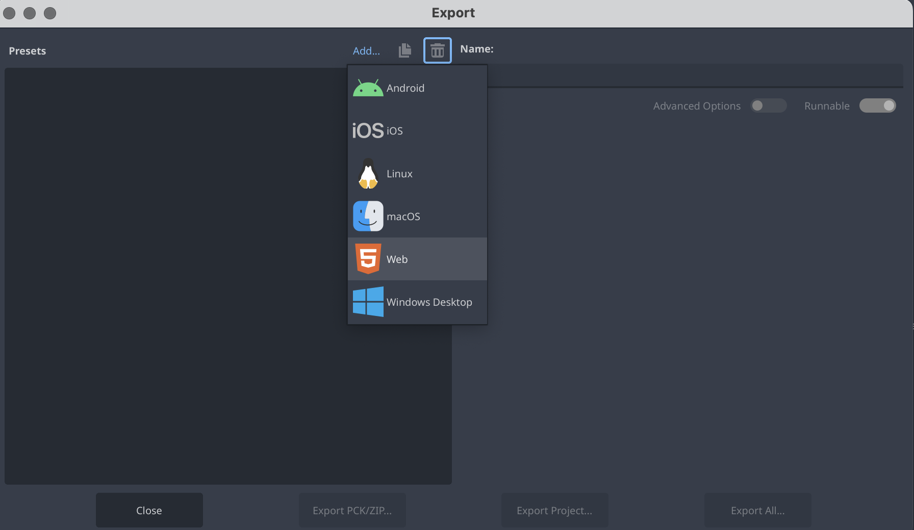
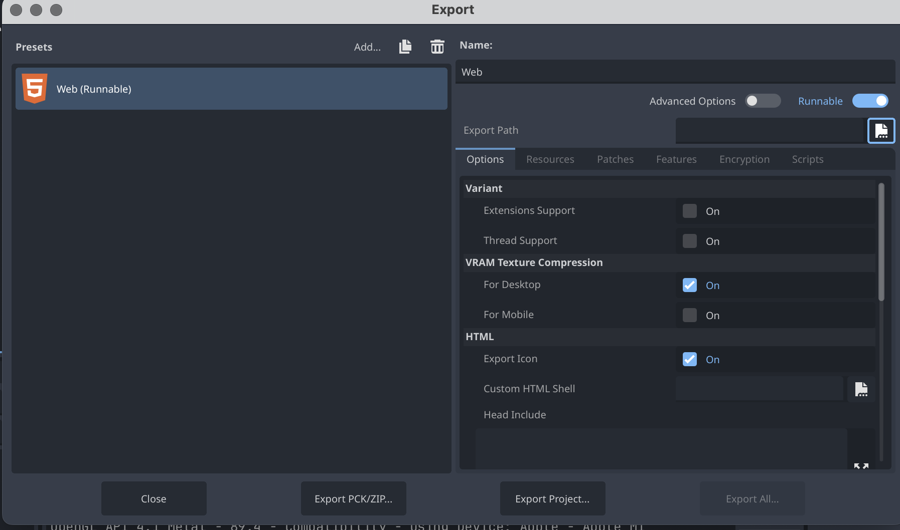
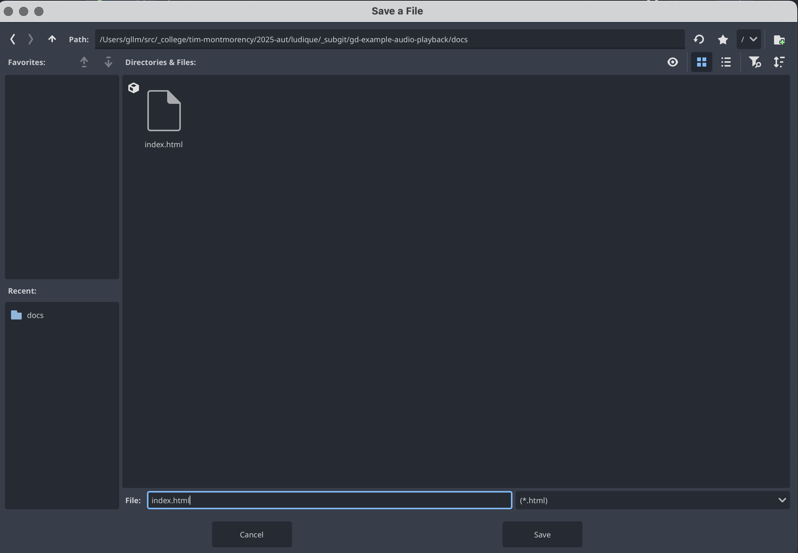
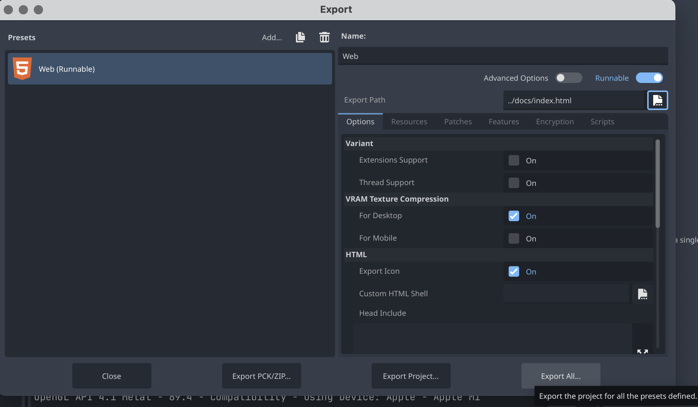
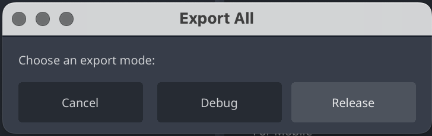
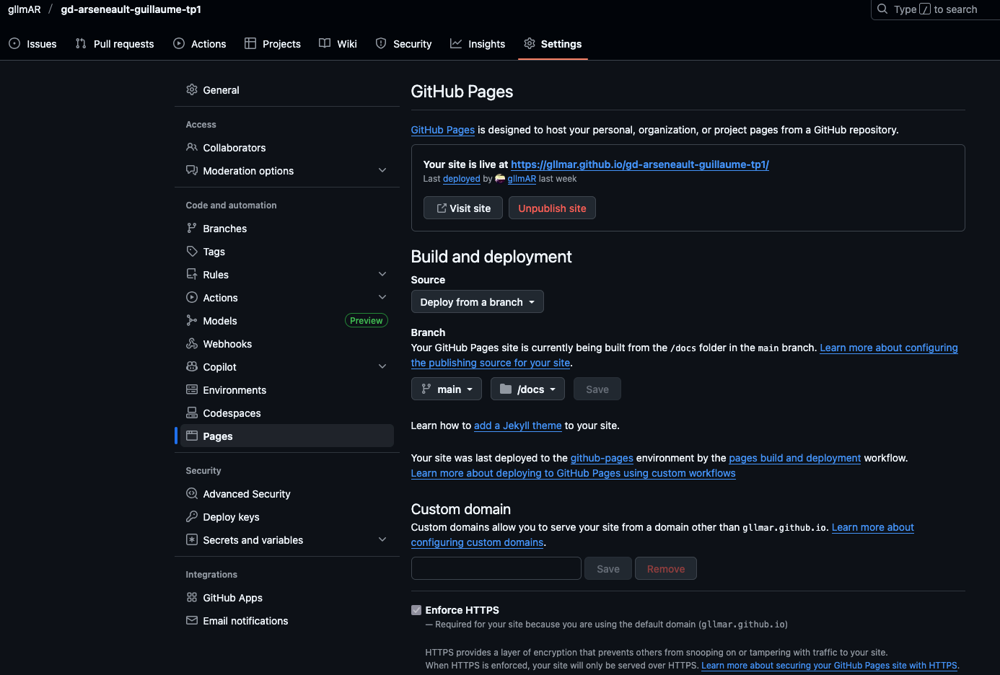

# Compilation de l’application (web export)

## Objectif
Exporter un projet Godot 4.4.1 vers le Web (HTML5) et placer les fichiers d'export dans le dossier `../docs` du dépôt (structure utilisée pour GitHub Pages).

## Arborescence recommandée (contexte)
Exemple de dépôt attendu :
- $nom_$prenom-tp1/
    - docs/               # dossier d'export web (hébergé par GitHub Pages)
    - projet/             # racine du projet Godot
        - project.godot
        - assets/
            - audio/
            - images/
        - ...
    - README.md
    - ...

Important : Godot exporte depuis la racine du projet (le dossier contenant project.godot). Le chemin `../docs` est relatif à ce dossier racine.


## Étapes pas-à-pas

1) Préparer le dossier docs
- Créer le dossier /docs dans votre arborescence 

2) Ouvrir le projet dans Godot
- Lancer Godot et ouvrir le projet (le dossier qui contient `project.godot`).

3) Vérifier les ressources et chemins
- S'assurer que toutes les images, sons et scènes sont dans le dossier du projet (ex : `assets/images`, `assets/audio`).
- Les chemins dans les scènes doivent utiliser `res://...` et pointer vers les fichiers inclus.

4) Installer / vérifier les templates d'export
- Project → Install Export Templates… → s'assurer que la version 4.4.1 est active.
- Sans templates corrects, l'option HTML5 n'apparaîtra pas.

5) Créer un preset d'export HTML5
- Project → Export…
- Cliquer "Add…" → sélectionner "HTML5".
- Configuration importante :
  - File : saisir le chemin relatif vers le dossier docs, par exemple `../docs/index.html`
    - Cela écrasera/écrira index.html et les fichiers associés dans `../docs`.
  - Options : décocher "Export With Debug" pour une version avec le débugage.
  - Vérifier les options de compression (si activées, vérifier compatibilité serveur).
  - Si vous utilisez un package personnalisé, assurez-vous que les ressources nécessaires sont inclues.

6) Exporter
- Cliquer "Export Project" → Godot va générer plusieurs fichiers dans `../docs` :
  - index.html
  - *.wasm (WebAssembly)
  - *.js
  - fichier .pck (si utilisé)
- Si l'export refuse d'écrire dans `../docs`, vérifier les permissions ou utiliser un chemin absolu (ex : `/Users/you/.../docs/index.html`) puis déplacer les fichiers.

* 
* 
* 
* 
* 
* 

1) Tester localement (important : ne pas ouvrir directement le fichier index.html dans le navigateur)
- L'export WebAssembly nécessite un serveur HTTP pour charger adéquatement. Depuis vscode, utilisez *live server* pour tester

1) Déployer sur GitHub Pages
- Commit et push du dossier `docs/` à la racine du dépôt.
- Sur GitHub → Settings → Pages → Source : Branch main (ou autre) / folder: /docs
- Attendre quelques minutes puis ouvrir l'URL fournie.

## Astuces et erreurs courantes
- Export ne trouve pas des fichiers : vérifier que les ressources sont dans le projet et référencées avec `res://`.
- Fichiers .wasm bloqués en local : utiliser un serveur HTTP, pas file://.
- Templates mismatch : installer les templates correspondant exactement à la version Godot (4.4.1).
- Chemin relatif : `../docs` est relatif au dossier contenant `project.godot`. Si project.godot est à la racine du dépôt (au lieu de `projet/`), adapter le chemin (`docs/index.html`).
- Si GitHub Pages n'affiche rien, vérifier la console réseau (404 pour .wasm ou .js) et la configuration MIME (rare avec GitHub Pages).

## Tester localement votre webexport
- Lancer serveur local depuis intégré dans vscode et naviguer /docs, vous devriez voir votre projet charger

## Déployer sur github

- Pousser les changements sur github

- Activer la publication de la page

 

- Deploy from a branch
- | main| /docs 
- save


## Example 

voir le dépot du projet: 
https://github.com/gllmAR/gd-webexport-minimal


le lien jouable 
https://gllmar.github.io/gd-webexport-minimal/


### Arborescence

```
.
├── capture-ecran.png
├── docs
│   ├── index.apple-touch-icon.png
│   ├── index.audio.position.worklet.js
│   ├── index.audio.worklet.js
│   ├── index.html
│   ├── index.icon.png
│   ├── index.js
│   ├── index.pck
│   ├── index.png
│   └── index.wasm
├── index.html
├── input-map.png
├── mon_projet
│   ├── audio
│   │   ├── 1_bar_120bpm_ripplerx-malletripplerx-mallet.ogg
│   │   ├── 1_bar_120bpm_ripplerx-malletripplerx-mallet.ogg.import
│   │   ├── 1_bar_120bpm_ripplerx-malletripplerx-mallet.wav
│   │   ├── 1_bar_120bpm_ripplerx-malletripplerx-mallet.wav.import
│   │   ├── 1_bar_120bpm_surge-dreamssurge-surge.ogg
│   │   ├── 1_bar_120bpm_surge-dreamssurge-surge.ogg.import
│   │   ├── 1_bar_120bpm_surge-dreamssurge-surge.wav
│   │   └── 1_bar_120bpm_surge-dreamssurge-surge.wav.import
│   ├── export_presets.cfg
│   ├── icon.svg
│   ├── icon.svg.import
│   ├── img
│   │   ├── fond.png
│   │   └── fond.png.import
│   ├── main.gd
│   ├── main.gd.uid
│   ├── main.tscn
│   ├── mallet.gd
│   ├── mallet.gd.uid
│   └── project.godot
└── README.md

```