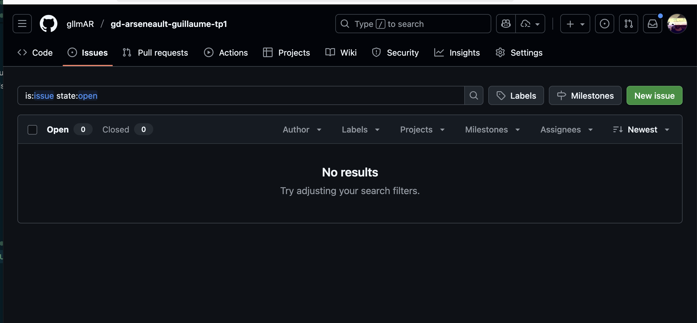
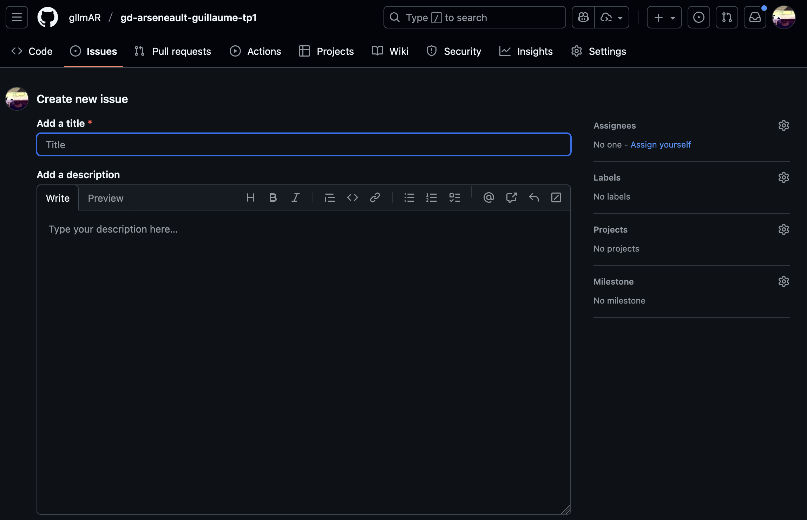
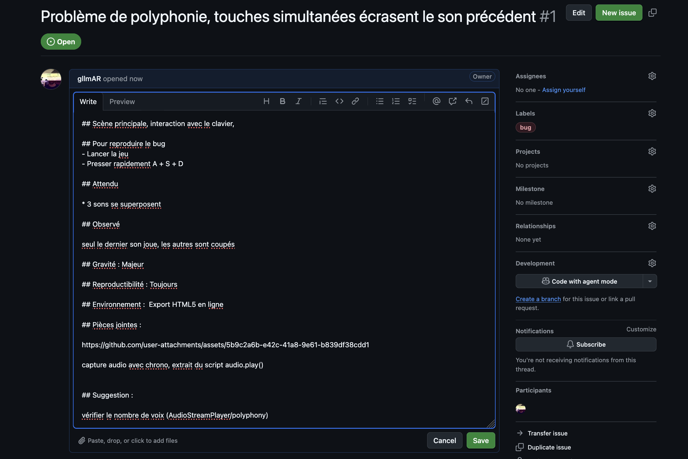

# Contrôle de la qualité


## Objectif

Comment créer un bon issue dans github et améliorer le controle de la qualité des jeux testés chez les pairs.

## Règles simples
- Restez factuel et poli.
- Un bug = un issue. Regrouper uniquement si les problèmes sont clairement liés.
- Fournir suffisamment d'informations pour reproduire le problème.





## Example minimal d'un issue

- Titre : [BUG] Bref résumé clair (ex : "[BUG] Son ne se joue pas à la touche A")
- Description :
   1. Scène / Où : Scène principale, interaction avec le clavier
   2. Pour reproduire le bug :
      - Lancer le jeu
      - Presser rapidement A + S + D
   3. Résultat attendu :
      - 3 sons se superposent
   4. Résultat observé :
      - Seul le dernier son joue, les autres sont coupés
   5. Gravité : Majeur
   6. Reproductibilité : Toujours
   7. Environnement :
      - Export HTML5 en ligne
   8. Pièces jointes :
      - Capture audio avec chrono
      - Extrait du script (ligne autour de audio.play())
   9. Suggestion :
      - Vérifier le nombre de voix (AudioStreamPlayer/polyphony) ou la gestion des bus audio

## Bonnes pratiques pour pièces jointes

- Captures : recadrer pour montrer l'élément pertinent.
- Vidéo/GIF : 5–15 s montrant la reproduction.
- Logs : coller la sortie d'erreur ou capture de la console réseau (pour web .wasm/.js).
- Fichiers : si nécessaire, pointer vers la scène ou le fichier (ex : res://scenes/level1.tscn).

## Étiquettes et priorités (conseillé)
- bug, enhancement, question, help-wanted
- priority: high / medium / low
- area: audio / visuals / input / export

## Exemple d'issue (concise)
Titre : [BUG] Touches simultanées écrasent les sons, problème de polyphonie

```markdown
## Scène principale, interaction avec le clavier,

## Pour reproduire le bug 
- Lancer la jeu
- Presser rapidement A + S + D

## Attendu 

* 3 sons se superposent

## Observé 

seul le dernier son joue, les autres sont coupés

## Gravité : Majeur

## Reproductibilité : Toujours

## Environnement :  Export HTML5 en ligne

## Pièces jointes : 

https://github.com/user-attachments/assets/5b9c2a6b-e42c-41a8-9e61-b839df38cdd1

capture audio avec chrono, extrait du script audio.play()


## Suggestion : 

vérifier le nombre de voix (AudioStreamPlayer/polyphony)
```



voir https://github.com/gllmAR/gd-arseneault-guillaume-tp1/issues/1

## Conseil de relecture avant soumission
- Le titre est-il clair ?  
- Le ton est-il poli? 
- Les étapes reproduisent‑elles le bug sur une machine propre ?  
- Ai‑je joint les fichiers/vidéo nécessaires ?
- Est-ce constructif? 

