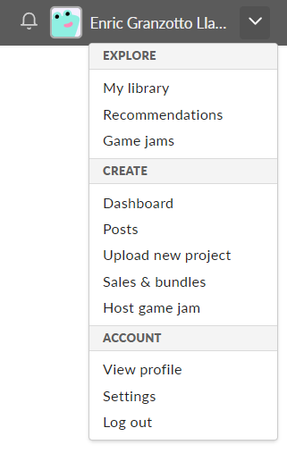
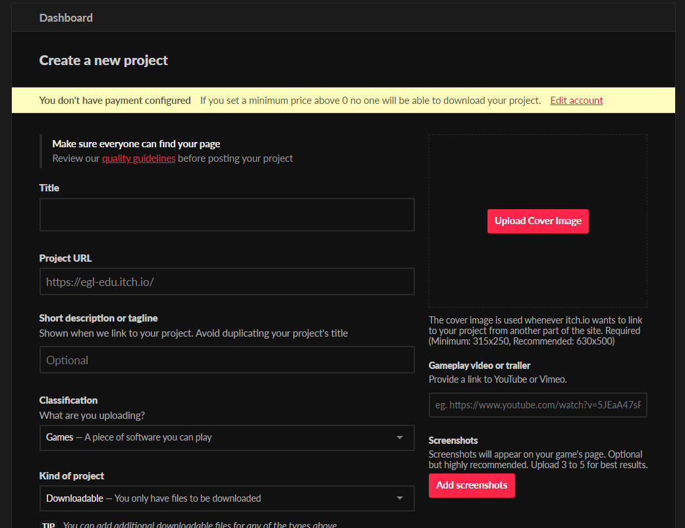
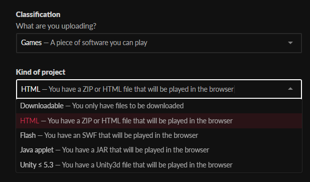
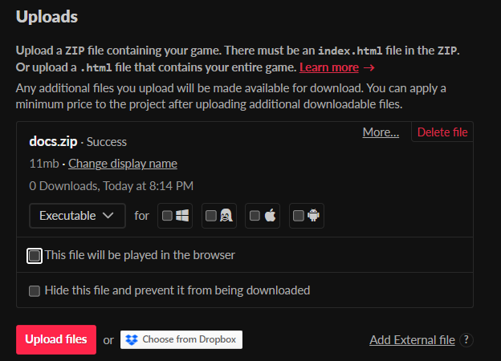

# Déploiement web sur Itch.io

## Page web du jeu

Un de premiers contacts que les joueurs vont avoir avec votre jeu est la page de produit sur les plateformes de distribution numérique. Ce site web est très important pour communiquer les points forts de l'expérience de jeu, sa qualité de production et ces aspects originaux. 

Certaines informations sont attendues d'une page web publique de jeu. Voici une liste simple:

- Nom du jeu
- Résumé narratif
- Contexte
- Instructions de jeu et infos pratiques (plateforme compatible, prix, date de publication)
- Informations sur l'équipe de création ou studio
– Crédits (d’équipe et de médias utilisés)
- Captures d'écran
- Vidéo démo

Chaque plateforme a son format, ces contraintes et ces possibilités créatives pour considérer au moment de préparer une page de produit. Une plateforme comme Steam utilise plus des images et des vidéos intégrées dans un format visuel rigide. À la plateforme Itch, les développeurs ont la possibilité de customiser et présenter le jeu de façon plus libre et plus expressive en utilisant des technologies web, comme les customisations CSS et HTML. De toute façon, le processus de création d'une page web pour un projet de jeu implique un assemblage et montage des différents médias de façon intégrée et consistante.

C'est aussi très important de suivre les [directives de contenu de la plateforme Itch](https://itch.io/docs/creators/quality-guidelines), pour l'utiliser de façon correcter et sans avoir des problèmes avec la modération.

### Ressources

- Guides pour la création de page web sur Itch
	- [Documentation officielle de Itch](https://itch.io/docs/creators/design)
	- [Guide pour la création de page web sur Itch](https://hedgiespresso.itch.io/itch-page-image-templates) (par Star West), avec des dimension des images et templates pour Photoshop et d'autres éditeurs d'image
- Listes de bons exemples
	- [Cool Game Pages](https://itch.io/c/1536/cool-game-pages) (par itch)
- Exemples intéressants
	- **Reap**, par Daniel Linssen : https://managore.itch.io/reap
	- **ULTRAVIOLET** : https://vltrauiolet.itch.io/i
	- **Racine**, par Hugues Laborde : https://hugues-laborde.itch.io/racine
	- **Isle of Lore** : https://stevencolling.itch.io/isle-of-lore-2-hex-tiles-regular
	- **Th stilness of the wind**, par Fellow Traveller : https://fellowtraveller.itch.io/the-stillness-of-the-wind 
	- **Planetarium**, par Daniel Linssen : https://managore.itch.io/planetarium

## Déploiement du jeu en ligne

Le système Itch est très fexible et permet de créer différents types de contenus (jeux, ressources, bandes dessinées, etc.). Comme on a travaillé avec la version web de notre jeu, on va explorer l'option **HTML**. Pour déploier un build de notre jeu, on va créer un fichier **zip** avec les contenus exportés de Godot (i.e. le contenu de notre dossier `docs`) et le télécharger.

Il faut toujours tester le déploiement pour vérifier que la fênetre a une bonne taille, que les sons sont bien intégrés, que les contrôles sont fonctionnels, etc. C'est possible aussi de choisir l'option de visibilité "Restricted"  et même de définir des mot de passe pour tester le dépliement de façon plus privé : par exemple, [une page de test est disponible ici](https://egl-edu.itch.io/test-deploiement-godot) avec le mot de passe "test". Pour réviser les options de déploiement  et continuer à éditer la page du jeu, on peut cliquer sur **Edit game** dans la barre d'outils.

Un autre exemple d'un projet déploié sur Itch est disponible ici : <https://gllmar.itch.io/gd-empd-examples>.

