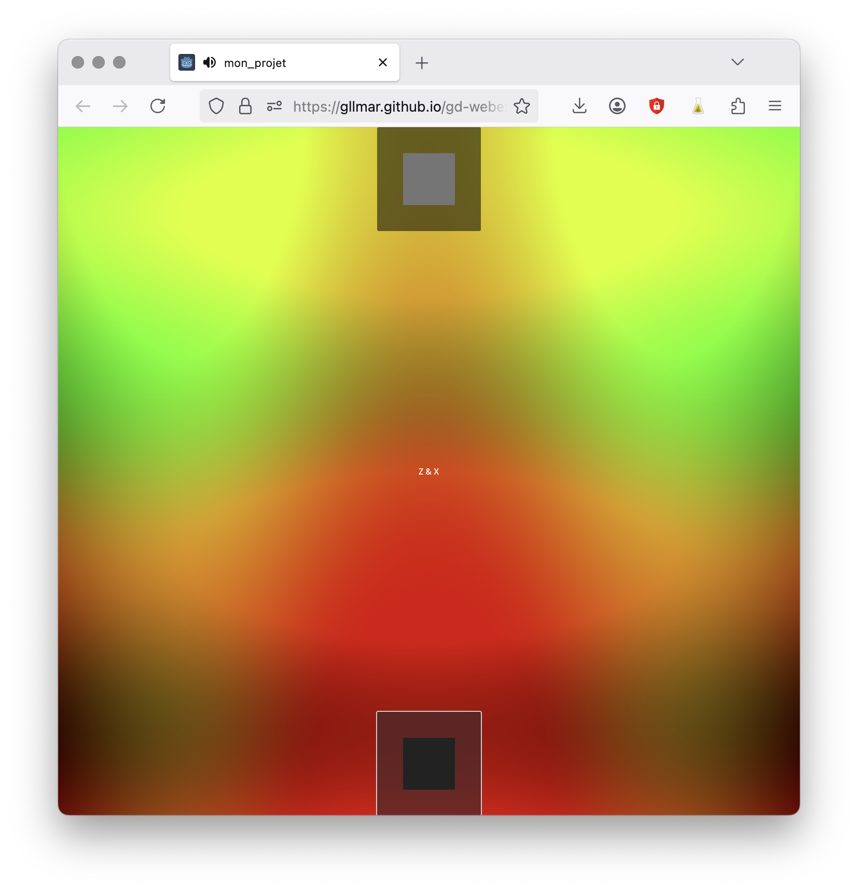

# Projet simple

Example d'un projet simple hébergé en ligne qui utilise du son et des animations visuelles.

## Code source (github)

* [https://github.com/gllmAR/gd-webexport-minimal](https://github.com/gllmAR/gd-webexport-minimal)

## Lien jouable 

* [https://gllmar.github.io/gd-webexport-minimal/](https://gllmar.github.io/gd-webexport-minimal/)

## Documentation du projet

[documentation remote](https://raw.githubusercontent.com/gllmAR/gd-webexport-minimal/refs/heads/main/README.md ':include')