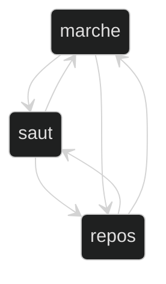
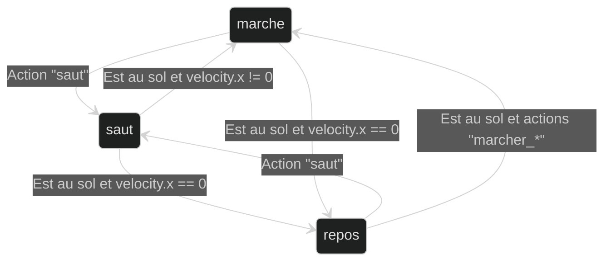

# Détection de l'état de personnage

Pour contrôler un objet dynamique qui a des comportements bien distinctes, c'est important d'identifier quel est la situation courante de cet objet. 

Par exemple, si j'ai un personnage qui peut sauter ou se promener ou rester en repos, comment je peux savoir quel est sont comportement courant ? Quels questions je peut poser pour les différencier ?

Je vais commencer par lister mes **états possibles** : 

- SAUT
- MARCHE
- REPOS

En diagramme :



Après, je peut lister les **conditions necéssaires** pour trouver quel est le comportement courant.

- SAUT
    - Conditions
        - Le personnage est dans l'air.
- MARCHE
    - Conditions
        - Le personnage est au sol (collision en bas du personnage).
        - La vitesse horizontal est plus grand ou plus petite que zéro.
- REPOS
    - Conditions
        - Le personnage est au sol (collision en bas du personnage).
        - La vitesse horizontal est égale à zéro.

J'ai besoin de **savoir à tout moment** à quel état mon personnage est, donc je veux vérifier dans une fonction qui est exécutée à chaque frame, comme `_process()` ou `_physics_process()`. Je vais aussi utiliser une variable du type `enum` pour garder quel est l'état courant

```gdscript
# en haut de mon script
var état_courant

enum Etat {
    REPOS,
    MARCHE,
    SAUT
}


func _process(delta):
    # Condition SAUT
    if not is_on_floor():
        print("SAUT!)
        etat_courant = Etat.SAUT
    
    # Condition MARCHE ou REPOS (on peut utiliser un else aussi ici)
    if is_on_floor():
        # Condition MARCHE
        if velocity.x != 0:
            print("MARCHE")
            etat_courant = Etat.MARCHE
        else:
            print("REPOS")
            etat_courant = Etat.REPOS
```

Après que je connais l'état courant, je peut commencer à réfléchir quel sont les actions et effets possibles de chaque état. Par exemple: à oartir de quels états je peux commencer à sauter ? Est-ce que je peux sauter un autre si je suis déjà en train de sauter ? En sommaire: comment je peux changer d'un état à l'autre ? C'est ici qu'on peut lister les entrées du joueur à considérer et les effets comme changer la vitesse ou des animations.

- MARCHE
    - Conditions
        - Le personnage est au sol (collision en bas du personnage).
        - La vitesse horizontal est plus grand ou plus petite que zéro.
    - Transitions et effets
        - Jouer l'animation `"marche"`
        - Si l'action `"saut"` (Space) est pressé:
            - Changer la vitesse verticale à -300

En diagramme :



On peut après traduir cette définition en code :

```gdscript
func _process(delta):
    # D'autres instructions...
    
    # Condition MARCHE ou REPOS (on peut utiliser un else aussi ici)
    if is_on_floor():
        # Condition MARCHE
        if velocity.x != 0:
            print("MARCHE")
            etat_courant = Etat.MARCHE
            $AnimatedSprite2D.play("marche")
            if Input.is_action_pressed("saut"):
                velocity.y = -400

    # Continuation de la logique...
```

