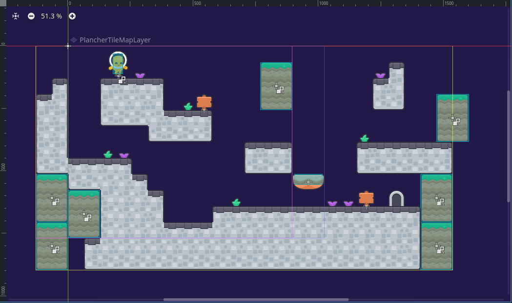

# Création d’un environnement virtuel navigable

Un environnement virtuel navigable implique un espace avec des obstacles solides, zones de passage et élements de décor. Il a des proportions adéquates pour que les personnages et objets interactifs puissent le traverser de façon intéressante.

Les objets solides dans un monde de jeu ont des **zones de collision** (ou *colliders*). Ces composants définent la forme et volume que ces objets occupent à l'espace. En Godot, la forme des collisions sont définis par des noeuds `CollisionShape2D` ou `CollisionPolygon2D`, qui sont placés comme fils des nooeuds qui vont définir de comportements spécifiques et qui héritent de `PhysicsBody2D`.

## Objets solides

Le `StaticBody2D` crée des objets solides qui ne se déplacent pas et ne sont pas impactés par d'autres objets (ex. un mur). Les `AnimatableBody2D` peuvent être animés et vont impacter d'autres objets, mais ne sont pas impactés par contre (ex. une plateforme mobile). Les `RigidBody2D` sont des corps physique 2D qui sont déplacés par une simulation physique (ex. une boule dynamique). 

Vous trouverez plus d'info sur les [objets de collision à la documentation officielle](https://docs.godotengine.org/fr/4.x/tutorials/physics/physics_introduction.html#collision-objects).

## Areas de détection

Le noeud [`Area2D`](https://docs.godotengine.org/fr/4.x/tutorials/physics/physics_introduction.html#area2d) utilise les zones de collision pour détecter quand un autre objet entre ou sort de son `CollisionShape2D`.  Ils peuvent détecter quand les objets se chevauchent et émettre des signaux quand les corps entrent ou sortent. On peut les utiliser pour déclencher des événements et comportements. 

## Cartes editables (`TileMapLayer`)

(À venir).
