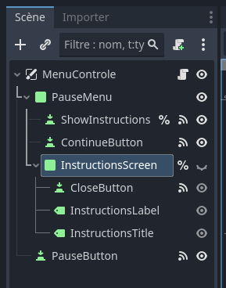
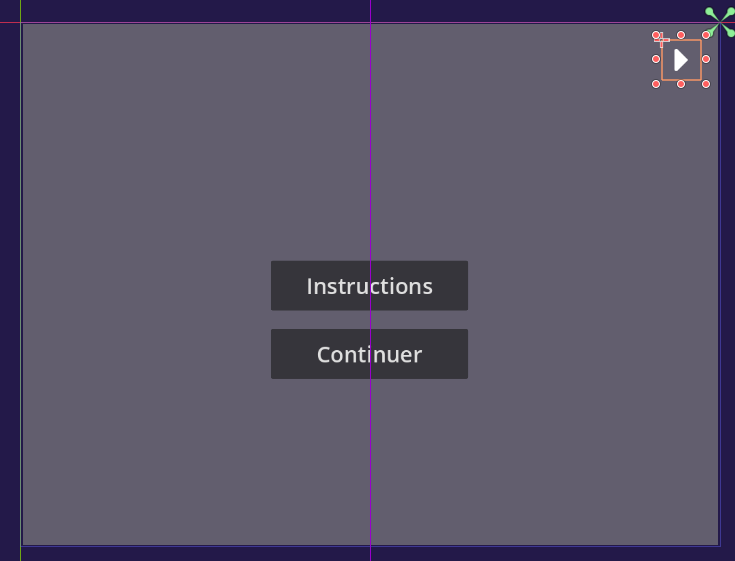
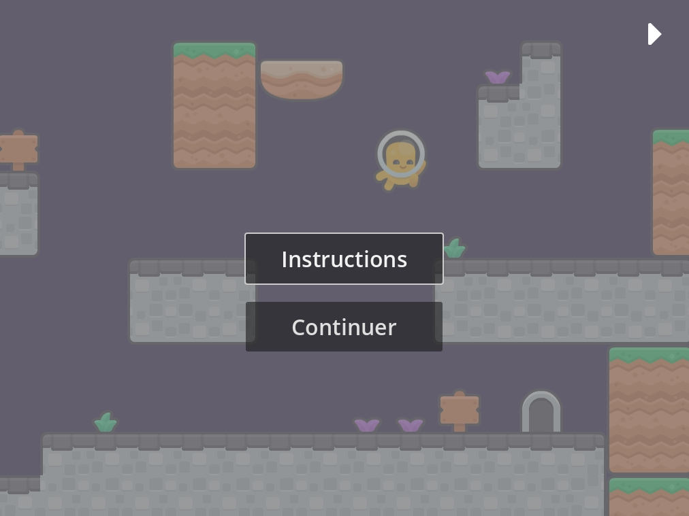

# Interface virtuelle (menu et pause)

## Menus

Souvent, les jeux vidéo fixent des informations importantes à l'écran, comme le comptage de points ou les points de vie du personnage. Pour créer un menu qui est affiché à tout temps, il faut que l’on configure nos éléments d'interface pour être rendus indépendamment de la position de la caméra.

Dans Godot, on peut créer un nœud **CanvasLayer** pour créer une couche des nœuds qui vont être rendus séparément du reste de la scène. Les objets de l'interface (hérités de **Control**) sont placés comme fils de ce CanvasLayer pour définir le layout et organisation des différents éléments d'interface.

Exemple d'**arborescence** :

```
- InterfaceNiveau (CanvasLayer)
    - HUD (Control)
        - BarreVie (ProgressBar)
        - LabelPointage (Label)
        - ControlePause (Button)
        - PanneauPause (Panel)
            - ButtonInstructions (Button)
```



Les noeuds d'interface ont des options de placement adaptatif et auto-gérés et d'utilisation de thèmes visuels. C'est un système fléxible et élaboré; pour plus d'information, regarder la [documentation officielle](https://docs.godotengine.org/fr/4.x/tutorials/ui/index.html).



De façon résumé:

1. Les nœuds hérités de **Control** nous permettent de placer les éléments de façon relative à leurs parents avec différents comportements d'adaptation. Pour ça, ils utilisent des **[ancres](https://docs.godotengine.org/fr/4.x/tutorials/ui/size_and_anchors.html)**. Les ancres contrôlent l’étirement (ou non) d’un nœud-fils pour suivre les dimensions et le placement de son nœud parent.
2. Les options de **thème** nous permettent de définir une [habillage] (https://docs.godotengine.org/fr/4.x/tutorials/ui/gui_skinning.html) centrale pour nos éléments d'interface et aussi de personnaliser les options de thème pour chaque élément. On a déjà utilisé ça un peu pour customiser la taille des polices de caractères d'un **Label**, par exemple.
3. Les [nœuds conteneurs](https://docs.godotengine.org/fr/4.x/tutorials/ui/gui_containers.html)  (**containers**) contrôlent automatiquement le placement et la taille de ses nœuds-enfants (ex. ScrollContainer, TabContainer, GridContainer). Ils sont particulièrement pratiques pour les interfaces plus complexes et dynamiques.

## Pause

Les systèmes de pause dans les jeux vidéo généralement fonctionnent en arrêtant l'exécution des fonctions et des simulations qui sont calculées à chaque frame. Généralement ça veut dire que la configuration de *process mode* ou **modes de traitement** de chaque objet change temporairement.

Pendant la pause, les fonctions `_process()`, `_physics_process()`, `_input()`, et `_input_event()` ne sont pas exécutées, mais les noeuds vont continuer à recevoir des signaux. Les animations et audio sont mis en pause, et la simulation phyisique aussi.



### Mise en place

Dans Godot, on a plusieurs options de mode de traitement pour les noeuds dans une scène: 

> - **Inherit** : L'exécution dépend de l'état du parent, du grand-parent, etc. Le premier parent qui a un état n'étant pas Inherit.
> - **Pausable**: Traité seulement quand quand le jeu n'est pas pausé.
> - **WhenPaused**: Traité seulement quand quand le jeu est pas pausé.
> - **Always**: Traité le noeud à tout temps.
> - **Disabled**: Le noeud n'est jamais traite (`process()` n'est jamais exécuté).

Pour plus d'info, regarder la [documentation officielle](https://docs.godotengine.org/fr/4.x/tutorials/scripting/pausing_games.html).

Donc, il faut configurer les nœuds que l’on veut faire pause avec le mode de processus `Pausable` (par exemple, les personnages, les animations et l’affichage du jeu). Les objets que l’on veut animer ou qui doivent réagir à des entrées pendant la pause doivent avoir un *process mode* `Always` ou `WhenPaused`. On pense par exemple aux interfaces virtuelles, aux boutons de menu ou aux sources de musique de menu qui continuent de jouer.

### Activation et désactivation

Pour activer la pause, on utilise le command:

```gdscript
get_tree().paused = true # ou false, pour désactiver la pause
```
