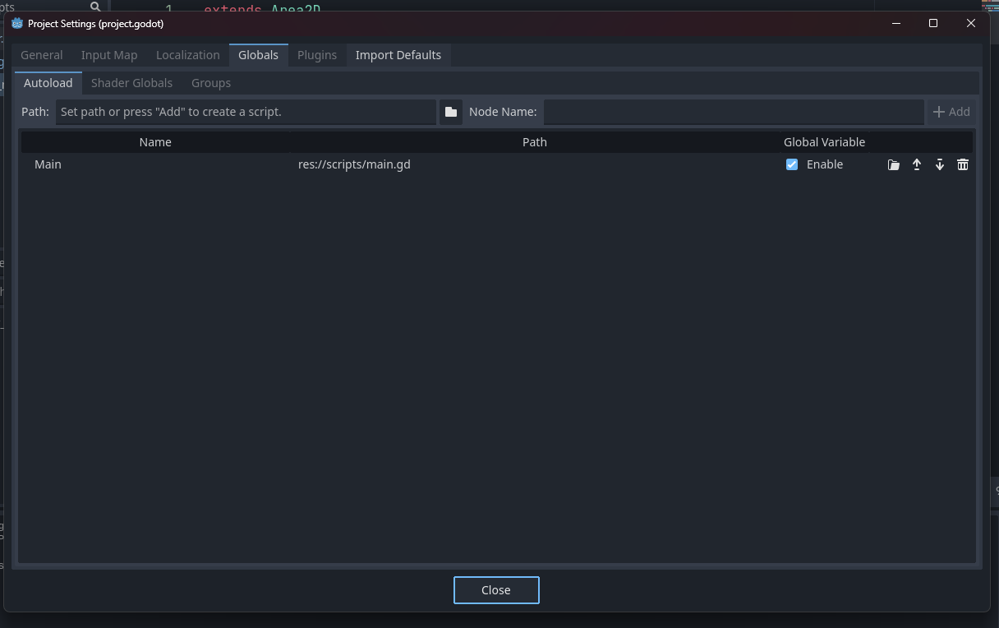
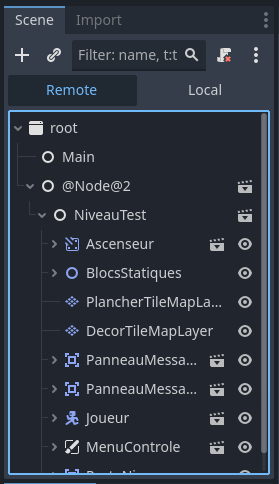
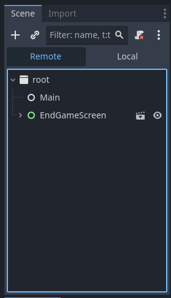

# Transitions de scènes

Quand on commence un jeu Godot, il va charger quelques scènes et les ajouter à un nœud racine du type **Viewport**. Tous les composants de notre niveau proviennent de différentes scènes et de nœuds. Par conséquent, pour charger un nouveau niveau, il suffit de modifier les scènes actives dans notre arborescence.

La façon plus directe de changer la scène utilise la méthode `change_scene_to_file()`. Cette méthode change l'arborescence par complet et le remplace avec les contenus de la nouvelle scène. On peut changer une scène à un path de fichier de scène ou on peut utiliser une référence à un objet du type **PackedScene**, avec la méthode `change_scene_to_packed()`. 

```gdscript
# Mon nouveau niveau est dans le fichier "res://scenes/niveau_02.tscn"


func on_door_body_entered(body):
    if body is Player:
        change_scene_to_file("res://scenes/niveau_02.tscn")
```

Cette stratégie comporte des inconvénients si elle n’est pas adaptée en conséquence. Par exemple, elle nous empêche de continuer à jouer un son ou une animation pendant la transition de scène, parce que tous les nœuds actifs vont être changés. Habituellement, on veut maintenir quelques nœuds pendant qu’on change de scène : le nœud avec la musique ou avec les éléments qui persistent de notre interface graphique. Pour faire ça, une des alternatives est les nœuds marqués comme **Autoload**.

## Les nœuds Autoload


Un nœud (ou un script) marqué comme autolad est configurable dans les **Paramètres du projet > Globals**. 



Un nœud Autoload est chargé et ajouté à l'arborescence de scène à chaque fois qu'on exécute une scène de notre projet, même si elle n'est pas la scène principale. Les nœuds fils de notre Autoload resteront actifs même lors du changement de scène, ce qui permettra à un AudioStreamPlayer de notre Autoload de continuer à diffuser de la musique pendant le processus de changement de scène. 





On peut aussi configurer un autoload pour être accessibles globalement dans nos scripts, et ça nous permet de rapidement exécuter des fonctions globales.


```gdscript
# Dans un noued "Porte" basé sur un Area2D
extends Area2D

@export var nouvelle_scene:PackedScene

func _on_body_entered(body: Node2D) -> void:
    if body is Joueur:
        Main.changer_scene(nouvelle_scene)


# Dans le script "main.gd", marqué comme un autoload
extends Node

func changer_scene(nouvelle_scene:PackedScene):
    print("changer scene")
    get_tree().change_scene_to_packed(nouvelle_scene)
```

Avec notre autoload, on peut l'utiliser aussi pour détruire et instancier différentes parties de notre jeu au besoin quand on charge un nouveau niveau. Voici un exemple de [custom scene switcher dans la documentation officielle](https://docs.godotengine.org/en/stable/tutorials/scripting/singletons_autoload.html#custom-scene-switcher). Par exemple, si je veux que l'interface HUD et la musique continuent, mais je veux afficher un nouvel environnement, je peux configurer mon autoload pour détruire seulement l'environnement précédent et l'objet du joueur et instancier un nouveau niveau et une nouvelle copie de mon personnage.