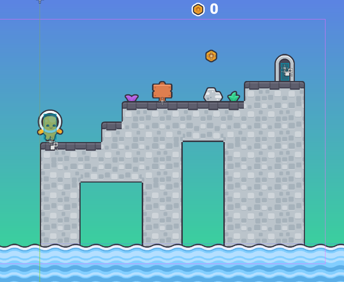
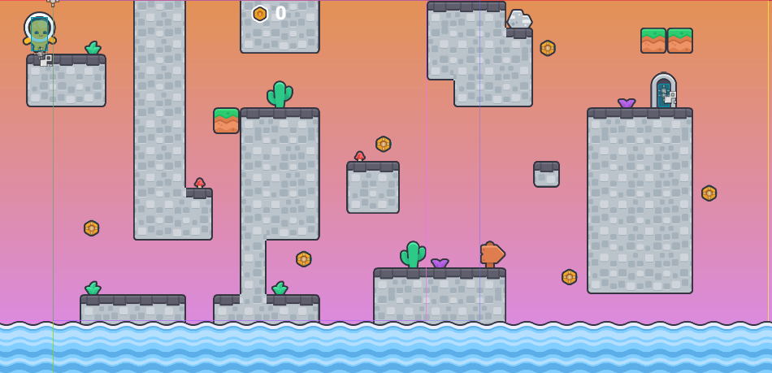

# Progression aux jeux vidéo

## Analyse

Jouez les 2 niveaux de l’exemple multi-niveaux ([lien jouable](https://egl-edu.github.io/exemple--multi-niveaux/), [repo](https://github.com/egl-edu/exemple--multi-niveaux)). 

Voici les cartes de ces deux niveaux. Quelles sont les principales différences entre les niveaux ? Quelles sont la progression et les relations entre eux ?

<!--

- Développement thématique
  - Mécaniques
    - Combinaison des mécaniques
    - Systèmes que se rendent plus complexes
  - Narratif
- Entre dificulté et rhythme
  - Apprentissage
  - Répétition et performance

-->