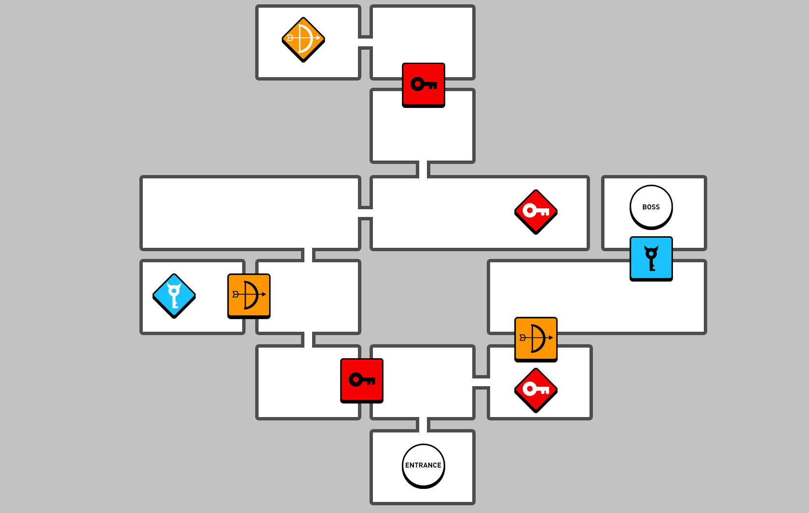
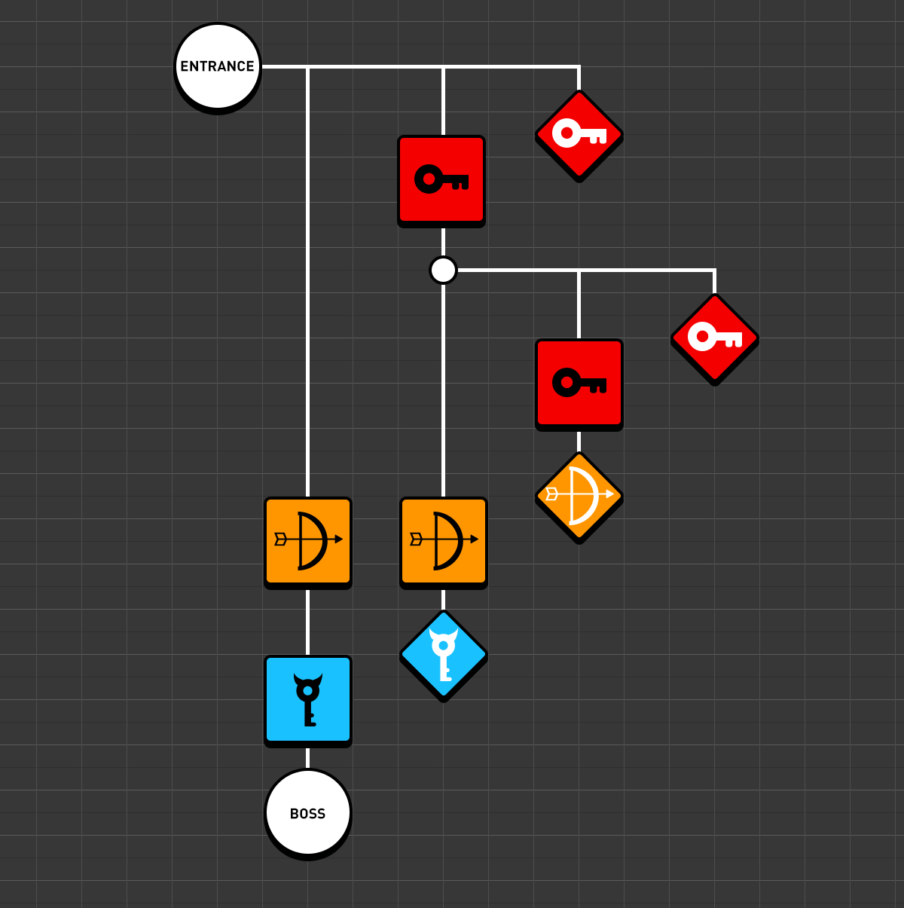

# Programmation d’un système de clé et de porte

Ces systèmes connectent des obstacles avec des items ou conditions qui permettent le joueur de les traverser. On peut listes les clés et les "portes" (qui peuvent être d'autres types d'objets ou situations) pour analyser la séquence de défis et de obstacles qui vont conditionner le parcours des joueur.

Carte avec la distribution spatiale des clés et portes.


Diagramme logique de dépendences entre clés et portes.



<!--
Aussi connus comme *lock-and-key*, ce type de système est utilisé pour créer des objectifs variés dans les jeux. 

- [ ] Montrer le diagramme de Zelda
-->

## Assemblage dans Godot

Cette fiche présente un pattern pédagogique et pratique pour implémenter une mécanique simple "clé → porte" dans Godot : collecte d'un item (clé), mise à jour d'un état de joueur (inventory), et porte qui s'ouvre seulement si le joueur possède la clé.

Vous trouverez aussi une implémentation de cet example dans le 3e niveau de l'exemple multi-niveaux ([lien jouable](https://egl-edu.github.io/exemple--multi-niveaux/), [repo](https://github.com/egl-edu/exemple--multi-niveaux)).

**Objectifs pédagogiques**
- Comprendre la communication par signaux entre nœuds (**Area2D**, **Main**, **HUD**).
- Séparer la logique d'inventaire du visuel (HUD) pour une meilleure maintenabilité.
- Introduire des retours redondants (visuel + son) pour l'accessibilité et interactivité.

**Architecture recommandée (simple)**
- Player (CharacterBody2D) — gère `inventory` et émet un signal `key_collected`.
- Key (Area2D) — détecte l'entrée du joueur et appelle `player.collect_key("nom_de_clef")`.
- Door (Area2D ou StaticBody2D + CollisionShape2D) — vérifie `player.has_key("nom_de_clef")` au contact.
- HUD (CanvasLayer → Control) — écoute `key_collected` et affiche une icône ou un message.

**Exemple minimal (GDScript)**

1) Key — `key.gd` (Area2D)

```gdscript
extends Area2D

@export var key_name: String = "gold_key"

func _on_body_entered(body: Node) -> void:
    if body.is_in_group("player") and body.has_method("collect_key"):
        body.collect_key(key_name)
        call_deferred(queue_free)

# Connectez le signal `body_entered` à `_on_body_entered` dans l'éditeur
```

2) Player — `player.gd` (CharacterBody2D)

```gdscript
extends CharacterBody2D

signal key_collected(key_name)

# Cet dictionnaire peut-être placer sur un 
# objet autoload Main ou GameState
var inventory := {}

func collect_key(key_name: String) -> void:
    inventory[key_name] = true
    key_collected.emit(key_name)

func has_key(key_name: String) -> bool:
    return inventory.get(key_name, false)
```

3) Door — `door.gd` (Area2D)

```gdscript
extends Area2D

@export var required_key: String = "gold_key"

func _on_body_entered(body: Node) -> void:
    if body.is_in_group("player") and body.has_method("has_key") and body.has_key(required_key):
        # ouvrir : désactiver collision et jouer animation
        $CollisionShape2D.disabled = true
        if $AnimationPlayer:
            $AnimationPlayer.play("open")
    else:
        # feedback de ne pas passer par la porte 
        # ex. son, shake, message HUD, etc.
        pass

# Connectez body_entered -> _on_body_entered dans l'Inspector
```

4) HUD (pour la rétroaction) — `hud.gd` (Control sous CanvasLayer)

```gdscript
extends Control

onready var key_icon = $KeyIcon

func _ready():
    key_icon.visible = false
    var player = get_tree().get_root().find_node("Player", true, false)
    if player and player.has_signal("key_collected"):
        player.key_collected.connect(_on_key_collected)

func _on_key_collected(key_name: String) -> void:
    key_icon.visible = true
    # Option : animer / pulser
```

### Bonnes pratiques et variations

- Utiliser des groupes (`player`) pour tester le contact au lieu d'un check de classe stricte.
- Préférez les signaux pour la mise à jour du HUD (éviter les appels polling dans `_process`).
- Donnez un feedback sonore et textuel à la collecte pour l'accessibilité.
- Gate dynamique : la porte peut vérifier plusieurs clés ou conditions (collection d'objets, score, état de puzzle).
- Sauvegarde : stocker l'inventaire dans un autoload `GameState` si la progression doit être persistante.

### Tests rapides à effectuer

- Collecte : ramasser la clé et vérifier que l'icône HUD devient visible.
- Porte fermée : tenter d'entrer sans clé et vérifier le feedback (son/message).
- Porte ouverte : après collecte, approcher la porte et vérifier qu'elle s'ouvre et que la collision est désactivée.
